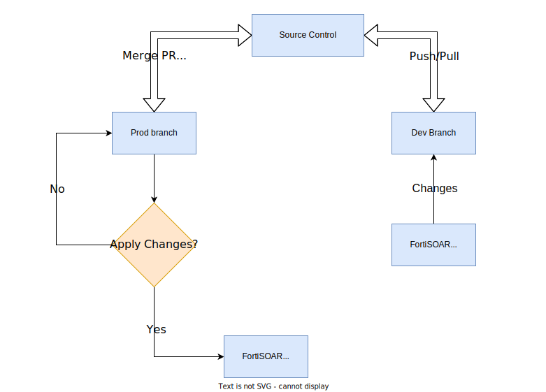

# Release Information

- **Version**:  1.0.0 
- **Certified**: Yes 
- **Publisher**: Fortinet 
- **Compatible Version**: FortiSOAR v7.3.1 and later 

# Overview

FortiSOAR CICD – Change Management solution pack helps automate your content development workflows and deploy better quality code using a continuous and iterative process to build, test, and deploy content avoiding bugs and code failures.

With Continuous Integration (CI) you can integrate all your code changes into the main branch of a shared source code repository early and often, automatically testing each change when you commit or merge them. FortiSOAR CICD – Change Management helps you create a development source control where you can merge your changes and test them until you are confident that the changes are ready to be pushed to production.

Continuous Delivery (CD) takes over during the final stages to ensure that the code can be pushed to a production environment (or a staging environment if you so choose) at any time. For a more granular control, you can review the code changes before pulling them from development into production or staging. Even then you can wait until you are ready to apply the changes to a production or staging environment.

The following diagram simplifies how FortiSOAR CICD – Change Management works:



## Intended Audience

This document is meant for content developers and FortiSOAR administrators who customize FortiSOAR content to suit their daily requirements. Customizations to FortiSOAR content can be pushed to source control in the development environment. After ironing out any issues with customizations and when confident about the custom content, the same can be pushed to the production source control to be delivered/deployed on the production FortiSOAR instance.

# Terminology

This section provides a comprehensive list of specialized terms and definitions used in this document. It serves as a reference guide to ensure that any communication regarding FortiSOAR's **Change Management** solution pack is clear and consistent. The section may include definitions, abbreviations, acronyms, and jargon that are unique to this solution pack.

This terminology section may be regularly updated to reflect any changes or additions to the terms used throughout this document.

1. **Content**: Content or FortiSOAR content includes customizable modules like playbooks, connectors, roles, module schemas, and solution packs to name a few.

2. **Production Settings**: Production settings are system views, application configuration, environment variables, account configuration, LDAP, SSO, and RADIUS configuration in a production environment.

3. **Development Settings**: Development settings are system views, application configuration, environment variables, account configuration, LDAP, SSO, and RADIUS configuration in a development environment.

4. **FortiSOAR Admin**: A FortiSOAR admin has administrative rights on any FortiSOAR instance. For more information on users and roles, refer to [Tasks & Permissions](https://docs.fortinet.com/document/fortisoar/7.3.1/administration-guide/249178/overview#Tasks_and_Permissions) in  FortiSOAR Administration Guide.

5. **Source Control**: Source control (or version control) is the practice of tracking and managing changes to code. Source control management (SCM) systems provide a running history of code development and help resolve conflicts when merging contributions from multiple sources. A common example of source control is **GitHub** .

6. **Source Control Production Admin**: A source control administrator has rights to create users, assign permissions, create, and manage repositories in an organization. Refer to the following article on GitHub detailing various user roles and access: [Roles in an organization](https://docs.github.com/en/organizations/managing-peoples-access-to-your-organization-with-roles/roles-in-an-organization).

# Initial Configuration

This section explains setting up initial configurations for GitHub source control.

1. **Setup a GitHub organization**: Creating a GitHub organization helps keep all repositories and users under a single umbrella.
    Refer to this article for [Creating new organizations](https://docs.github.com/en/organizations/collaborating-with-groups-in-organizations/creating-a-new-organization-from-scratch).

2. **Create users with admin access**: Once an organization is setup, users with administrative access are required for creating private repositories and other users with different access.

    Refer to this article for creating and assigning [Roles in an organization](https://docs.github.com/en/organizations/managing-peoples-access-to-your-organization-with-roles/roles-in-an-organization).

3. **Create Repositories**: Repositories can contain folders and files, images, videos, spreadsheets, and data sets – anything your project needs. Create repositories to store and collaborate on your content customizations.
    
    Refer to this article for [Creating and working with repositories](https://docs.github.com/en/get-started/quickstart/create-a-repo).

4. **Branching**: You can create branches so your changes do not affect the production content, and when ready can be merged into the main branch.

    Refer to this article on [Creating branches in a repository](https://docs.github.com/en/pull-requests/collaborating-with-pull-requests/proposing-changes-to-your-work-with-pull-requests/creating-and-deleting-branches-within-your-repository).

5. **Staging, Committing, and pushing changes in GitHub**
    1. **Staging**: To stage changes in Git, use the git add command followed by the name of the file you want to stage. For example, if you want to stage changes to a file named test.txt, use the following command:
    git add test.txt
    2. **Commit**: To commit changes in Git, use the git commit command with the switch -m followed by a commit message within quotes. For example:
    git commit -m “committing this file for textual purposes”
    3. **Push**: To push changes to a remote repository, use the `git push` command followed by the name of the remote repository and the branch to which you want to push.

        For example, if you want to push to a remote repository named `origin` and a branch named `latest-tinkering`, use the following command:

        ```
        git push origin latest-tinkering
        ```

        Refer to this article on [Contributing and collaborating on GitHub using GitHub Desktop](https://docs.github.com/en/desktop/contributing-and-collaborating-using-github-desktop).

6. **Working with 2FA – Personal Access Tokens**: Two-factor Authentication(2FA) adds an extra layer of security to your GitHub account by requiring a code generated by your authentication app or a physical security key in addition to your password.

    Refer to this article for [Accessing GitHub using 2FA](https://docs.github.com/en/authentication/securing-your-account-with-two-factor-authentication-2fa/accessing-github-using-two-factor-authentication).


# Next Steps 
 
| [Installation](./docs/setup.md#installation) | [Configuration](./docs/setup.md#configuration) | [Usage](./docs/usage.md) | [Contents](./docs/contents.md) |
|----------------------------------------------|------------------------------------------------|--------------------------|--------------------------------|
