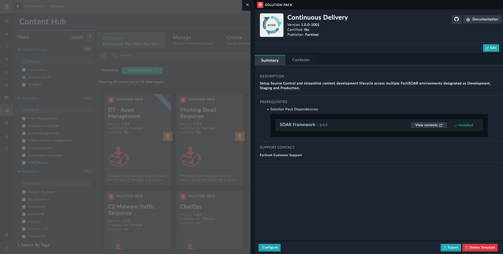
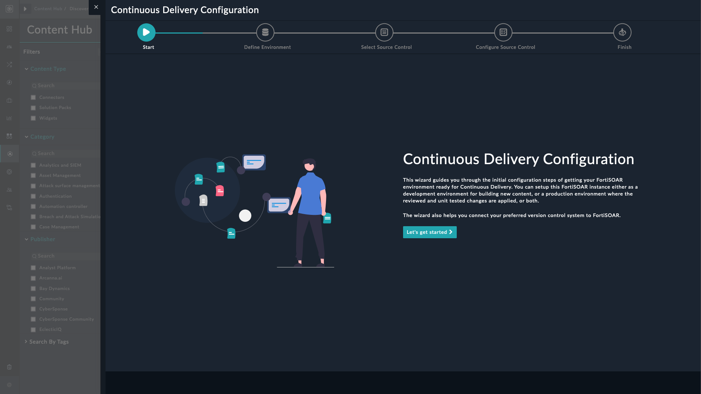
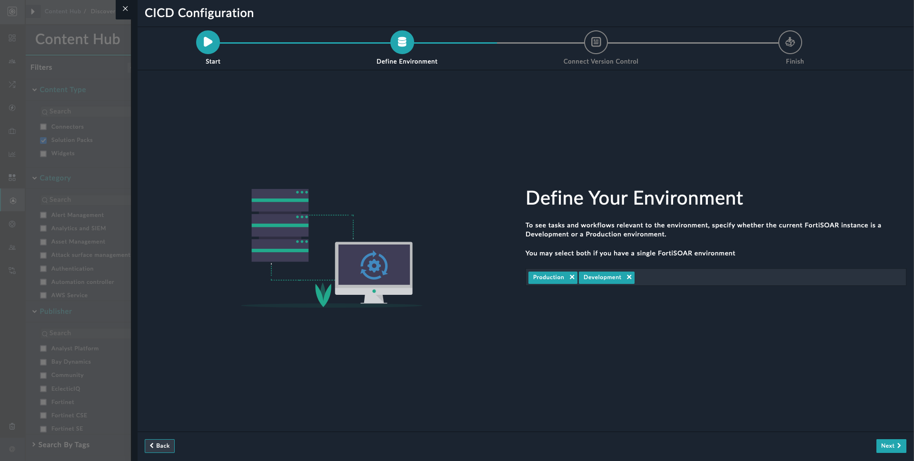
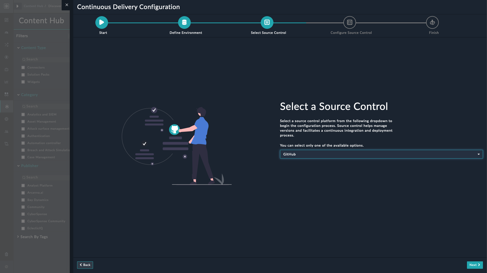
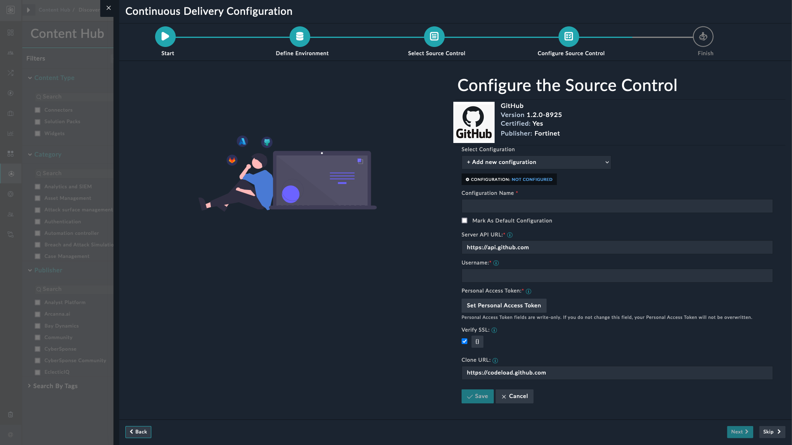
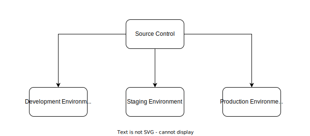
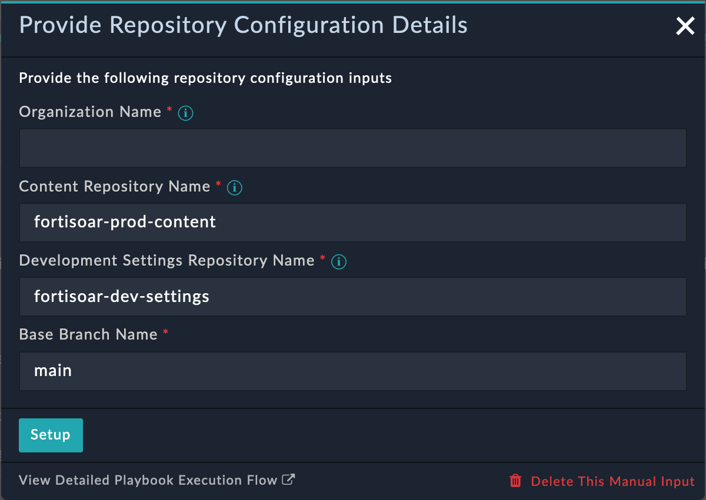

| [Home](../README.md) |
|----------------------|

# Installation

1. To install this solution pack, click **Content Hub** > **Discover**.

2. From the list of solution packs that appear, search for **Continuous Delivery** solution pack.

3. Click the **Continuous Delivery** solution pack card.

4. Click the **Install** button on the lower-left to begin the installation.

## Prerequisites

The **Continuous Delivery** solution pack depends on the following solution packs that are installed automatically &ndash; if not already installed.

| Name           | Type          | Version | Purpose                                          |
|:---------------|:--------------|:--------|:-------------------------------------------------|
| SOAR Framework | Solution Pack | v2.0.0  | Required for Incident Response modules           |
| GitHub         | Connector     | v1.2.0  | Required for source control through GitHub       |
| GitLab         | Connector     | v2.0.0  | Required for source control through GitLab       |
| CICD Utils     | Connector     | v1.1.0  | Required for performing CICD specific operations |

<table>
    <th>NOTE</th>
    <td>
<ul>
    <li>Install and Configure only <strong><em>ONE</em></strong> of the source control connectors</li>
    <li>Development and Production environments in FortiSOAR must have the same license type.</li>
</ul>
    </td>
</table>

Following are some prerequisites for using this solution pack:

1. **Organizational account**: An organization account is a type of account that represents an organization, instead of an individual user. It allows multiple users to collaborate on projects and manage access to repositories and teams. For more information, refer:

    - [Organization accounts - GitHub](https://docs.github.com/en/get-started/learning-about-github/types-of-github-accounts#organization-accounts)

    - [Create the organization parent group and subgroups - GitLab](https://docs.gitlab.com/ee/tutorials/manage_user/#create-the-organization-parent-group-and-subgroups)

2. **User Account**: Users must have their respective source control accounts. You can then use their usernames to invite them to your organization.

    - [Adding users to your organization - GitHub](https://docs.github.com/en/organizations/managing-membership-in-your-organization/can-i-create-accounts-for-people-in-my-organization#adding-users-to-your-organization)

    - [Add users to a project - GitLab](https://docs.gitlab.com/ee/user/project/members/#add-users-to-a-project)

3. **Source control platform's user roles**: To use the wizard for setting up source control and creating repositories through playbooks, FortiSOAR admin must have appropriate rights to create repositories on your preferred source control platform.

    - [Permissions for each role - GitHub](https://docs.github.com/en/organizations/managing-user-access-to-your-organizations-repositories/repository-roles-for-an-organization#permissions-for-each-role)

    - [Permissions and roles - GitLab](https://docs.gitlab.com/ee/user/permissions.html)

<table>
    <th>NOTE</th>
    <td>If the production FortiSOAR instance is separate from the development FortiSOAR instance, the content developers working in development environment must also be added in production FortiSOAR instance, and their respective source control usernames be appropriately mapped in connector configurations.</td>
</table>

4. **Source Control Repositories**: FortiSOAR's **Continuous Delivery** creates repositories for you during the setup process. Alternatively, you may prefer to map existing repositories with this solution pack.

    For mapping repositories with content changes on the FortiSOAR instance, there must be the following three repositories:

    1. **Production Content Repository**: Production content, dev content, staging and test changes reside on the *same* repository. To avoid accidental merges and conflicts, it is recommended that this branch be protected by using pull requests to merge developmental changes.

    2. **Production Settings Repository**: Production settings containing system views (e.g. Navigation Menu structure), application configuration, environment variables, account configuration, LDAP, SSO, and RADIUS configuration of a production environment are saved to this repository. Development environment must not have access to this repository as it uses production configurations and information.

    3. **Development Settings Repository**: Development settings containing system views, application configuration, environment variables, account configuration, LDAP, SSO, and RADIUS configuration of a development environment are backed up or synced on this repository.

        <table>
          <th>NOTE</th>
          <td>Source control users setting up production environment in the Continuous Delivery solution pack and creating repositories, must have permissions to create private repositories on their preferred source control platform.
        <ul>
          <li><a href="https://docs.github.com/en/organizations/managing-organization-settings/restricting-repository-creation-in-your-organization">Restricting repository creation in your organization - GitHub</a></li>
          <li><a href="https://docs.gitlab.com/ee/user/public_access.html#private-projects-and-groups">Private projects and groups - GitLab</a></li>
        </ul>
          </td>
        </table>

# Configurations

This section details the required configurations for optimal performance of the **Continuous Delivery** solution pack.

- A source control connector for tracking and managing changes to code:

    - To configure and use the GitHub connector to track and manage changes through GitHub, refer to [Configuring GitHub](https://docs.fortinet.com/fortisoar/connectors/github).

    - To configure and use the GitLab connector to track and manage changes through GitLab, refer to [Configuring GitLab](https://docs.fortinet.com/fortisoar/connectors/gitlab).

>**NOTE**: FortiSOAR users directly interacting with their preferred source control platform must be appropriately mapped with corresponding usernames in their source control's connector configurations.

## Setup Continuous Delivery on FortiSOAR

After installation of the **Continuous Delivery** solution pack, run the configuration wizard to ready your FortiSOAR environment. This wizard helps you connect your FortiSOAR development and production environments to your preferred source control.

1. Log in to FortiSOAR and [after installation](#installation), click the button **Configure** from the lower-left of the screen.

    

2. Click the button **Let's get started** on the CICD configuration page.

    

3. Specify whether you want the FortiSOAR instance to be a production environment or development environment and click **Next**.

    

4. Select a preferred source control platform from the following options:

    - GitHub
    - GitLab

    

5. Add configuration information for setting up interactions with your preferred source control platform. You can set up multiple configurations for multiple users, depending on their access levels. Click **Next** on the lower-right corner to proceed. You can skip configuring the connector now and click **Skip** to proceed.

    

    >**NOTE**: Select **+Add New Configuration** from the *Select Configuration* field to setup a new configuration.

6. Click **Finish** to complete the configuration process.

    

## Setup Production Environment

You can setup source control management through playbooks, automatically, or by pre-creating repositories on your preferred source control platform and linking them to FortiSOAR Continuous Delivery solution pack.

To setup your preferred source control platform and create repositories using playbooks:

1. Select **Continuous Delivery** from the FortiSOAR menu.

2. Click the button **Setup Source Control** under the **Setup** tab’s **Setup the Source Control for Production Environment** section.

3. Click the button **Setup Prod Environment** from the lower left part of the screen.

4. Enter the source control username with which to map the username you used to log in to FortiSOAR.

5. Enter the Source Control details:

    

    1. Enter the Organization’s name as created on your preferred source control platform.

    2. Enter the repository names to be created under the specified organization. To accept the auto-populated suggested name, leave the fields as-is.

    3. Enter the **Base Branch Name** to be created under the specified repositories. To accept the auto-populated suggested name, leave the field as-is.

    4. Click **Setup** to proceed.

    5. Click the button Create Repositories to let the playbooks automatically create the repos (repositories) and the specified branch in each repo.

        1. Click the button **I have the repositories** if you have already created the repositories, with the exact same names as specified in the earlier step, on your preferred source control platform.

        2. Click the button **Confirm**, after creating the repositories, for FortiSOAR to check if the specified repositories exist.

    6. Click the button **Push** to push the content from FortiSOAR to the specified branch of the repository mentioned in Production Content.
    Pushing overwrites the contents of the repository mentioned in Production Content. You can click the button Skip to push the contents later.

## Setup Staging Environment

Setting up a staging environment sets up a sandbox for testing out the content developed by the content developers before finally rolling out the changes in production.

Following image helps understand the placement of a pre-production or a staging environment:

<!--  -->

1. [Setup Development Environment](#setup-development-environment) on a separate FortiSOAR instance.

2. [Setup Production Environment](#setup-development-environment) on a separate FortiSOAR instance.

3. Setup Production Environment on a separate FortiSOAR instance and consider it *Staging Environment*.

4. [Apply latest changes](./usage.md#apply-latest-changes-in-production-environment) in the staging environment only after a successful run of those changes on the development environment.

5. The staging environment acts as a production environment for changes that have been successfully tested in the development environment. So setting it up is similar to [setting up production environment](#setup-production-environment).

6. After ensuring that the content changes are stable in production, only then you can [apply latest changes in production environment](./usage.md#apply-latest-changes-in-production-environment).

## Setup Development Environment

Once you have setup source control for production environment, move over to the development FortiSOAR instance to initiate the setup for development environment. This action aims to keep dev changes under the purview of source control.

1. Select **Continuous Delivery** from the FortiSOAR menu.

2. Click the button **Setup Source Control** under the **Setup** tab’s **Setup the Source Control for Development Environment** section.

3. Click the button **Setup Dev Environment** from the lower left part of the screen.

4. Enter the source control username with which to map the username you used to log in to FortiSOAR.

5. Enter the Source Control details:

    

    1. Enter the Organization’s name as created on your preferred source control platform.

    2. Enter the repository names to be created under the specified organization. To accept the auto-populated suggested name, leave the fields as-is.

    3. Enter the **Base Branch Name** to be created under the specified repositories. To accept the auto-populated suggested name, leave the field as-is.

    4. Click **Setup** to proceed.

    5. Click the button **Create Repositories** to let the playbooks automatically create the repo (repository) and the specified branch in each repo.

        1. Click the button **I have the repositories** if you have already created the repositories, with the exact same names as specified in the earlier step, on your preferred source control platform.

        2. Click the button **Confirm**, after creating the repositories, for FortiSOAR to check if the specified repositories exist.

    6. Click the button **Push** to push the content from FortiSOAR to the specified branch of the repository mentioned in Development Content.
    Pushing overwrites the contents of the repository mentioned in Development Content. You can click the button **Skip** to push the contents later.

## Working with Source Control and Continuous Delivery - Best Practices

Apart from best practices around source control like branching and merging strategies, committing code frequently with clear commit messages, automating the build process, and using a deployment pipeline for consistent and reliable releases; following pointers help avoid common pitfalls.

1. While creating repos using playbooks, ensure that your preferred source control platform's connector is configured.

    - Credentials used in the configuration must have sufficient privileges to create private repos in the specified organization.

    - Your preferred source control platform's username specified during configuration must be mapped with the user who is setting up the Source Control.

2. For repos with restricted merge access, during the initial commit the current logged in user must have sufficient privileges to push the code without raising a PR.

3. When mapping existing repos during Continuous Delivery's **Setup Source Control** process, ensure *Issues* & *Merge Commit* option are enabled for these existing repos.

4. Users and their tokens must have sufficient privileges for following actions:

    - Creating or closing a change request

    - Creating or deleting a branch

    - Merging a pull request (PR)

5. After applying latest changes [in production environment](./usage.md#apply-latest-changes-in-production-environment) or [in development environment](./usage.md#apply-latest-changes-in-development-environment), perform following actions for optimum performance:

    - Refresh the FortiSOAR page

    - Logout & Login

    - For a role change or addition, ensure the role is assigned to the appropriate user 

6. In case of conflicts in a pull request (PR), resolve the conflict on the source control platform before merging the PR.

7. Each development environment user must be mapped with their preferred source control platform's username in the *production* environment. 

8. Base Branch must never be deleted.

9. Following global variables must never be modified or deleted:

    - `cicd_config`

    - `cicd_env`

10. When setting role permissions, never allow **Delete** permission to the **Change Management** module.

11. Do not modify **Change Management** module's Service View Template (SVT).

12. Do not create a PR before pushing code to the related branch

13. Content developer must never be the PR reviewer.

14. Changes related to a single change request (CR) must never be pushed from multiple development environments.

15. After the action **Apply Latest Content** is run on development or production environment an **fsrimport-xxx**  file(For example `fsrimport-381e5a85-ccb5-4407-b5ea-97d294bb3a5e`) is created in the `/tmp` directory.

    These files are intended for deletion. To automate the process, you can establish a cron job to remove these files.