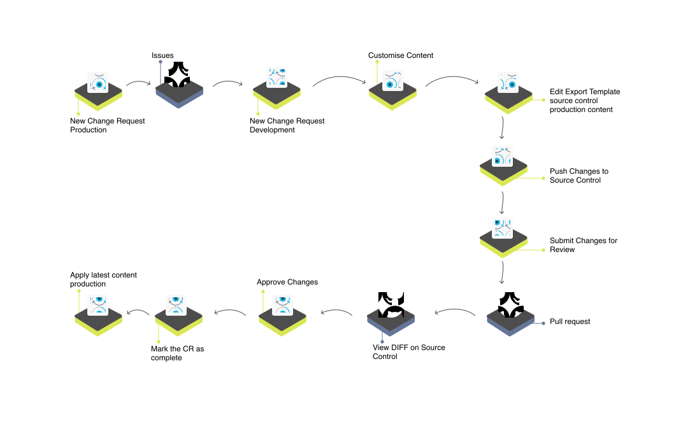

| [Home](../README.md) |
|----------------------|

# Usage

In this section we detail the various user flows to understand the scenarios where this solution pack’s automation addresses your needs.

## Lifecycle of a Change Request (CR)

The following pointers help understand the various steps of this lifecycle:

1. Application administrator creates a new change request in FortiSOAR.

2. The change request appears as a new issue under **Issues** in the source control platform's repository.

3. Content developer builds the content as detailed in the CR.

    - If required, the content developer edits the **Source Control - Production Content** export template to include the new content.

        >**WARNING**: Do not delete the existing export templates. If cloning the export templates, do not clone with the same name as the existing template.

4. Content developer selects the CR and clicks **Push Changes to Source Control**.

5. Content developer selects the CR again and clicks **Submit Changes for Review**.

6. A PR is created on the source control platform with the title and reviewers added by the content developer.

7. CRs with changes appear with a PR name under the column **Pull Request**.

    >**NOTE**: The reviewers must log in to their preferred source control platform to view the differences (`diff`).

8. Select the CR in FortiSOAR and click **Approve Changes**. This action merges the PR into the main branch and deletes the CR branch.

9. Select the CR again and click **Mark as Complete** to close the issue from FortiSOAR and the source control platform.

10. The changes made by content developer is now on the source control platform, but still needs to be applied to FortiSOAR's production instance.

11. Application administrator clicks the tile **Apply Latest Content** to initiate a `git merge` of content on the source control platform with content on the FortiSOAR instance.

## CR for Building a new Playbook

This task entails following sub-tasks:

1. Application administrator creates a new CR for building a new playbook. For creating a new CR refer to the [New Change Request from Production Environment](#new-change-request-from-production-environment).

2. Content Developer creates a new playbook. For creating new playbooks, refer to [Introduction to playbooks](https://docs.fortinet.com/document/fortisoar/7.3.1/playbooks-guide/331279/introduction-to-playbooks). 

    >Following actions must be carried out if the playbook requires a new playbook collection:
    >
    >1. Content developer creates a new collection and underlying playbooks.
    >
    >2. Content developer edits the export template and adds the newly created playbook collection in **Source Control – Production Content** export template. For details on editing an export template, refer to [Export Wizard](https://docs.fortinet.com/document/fortisoar/7.3.1/administration-guide/97786/application-editor#Export_Wizard).

4. Content developer initiates [action on the new Change Request](#working-on-the-new-change-request).

5. Application administrator [Approves & marks as complete the CR in Production environment](#approve--mark-as-complete-a-cr-in-production-environment).

6. Application administrator merges latest changes from the source control platform by [Applying Latest changes in Production environment](#apply-latest-changes-in-production-environment).

This flow is valid for all content customizations like:
- Reports
- Dashboards
- Playbooks
- Rules and channels, and
- Any other administrative and security settings.

## CR for Building a new Module

This task entails following sub-tasks:

1. Application administrator creates a new CR for building a new module. For creating a new CR refer to the [New Change Request from Production Environment](#new-change-request-from-production-environment).

2. Content Developer creates a new module. For creating a new module, refer to the article [Creating a New Module](https://docs.fortinet.com/document/fortisoar/7.3.1/administration-guide/97786/application-editor#Creating_a_New_Module).

3. Content developer adds the new module to the navigation menu. Refer to this article for [Modifying the Navigation Bar](https://docs.fortinet.com/document/fortisoar/7.3.1/administration-guide/97786/application-editor#Modifying_the_Navigation_bar).

4. Depending on the module and requirements, content developer may need to create new roles, or edit existing roles to assign permissions for the new module.

    1. For creating new roles, refer to the article [Adding Roles](https://docs.fortinet.com/document/fortisoar/7.3.1/administration-guide/202940/security-management#Adding_Roles).

    2. For editing permissions assigned to roles, refer to the article [Configuring Roles](https://docs.fortinet.com/document/fortisoar/7.3.1/administration-guide/202940/security-management#Configuring_Roles).

5. Content developer edits the **Source Control - Production Content** template to include module, roles, picklists, and any other content created to support the new module.

6. Content developer initiates [action on the new Change Request](#working-on-the-new-change-request).

7. Application administrator [Approves & marks as complete the CR in Production environment](#approve--mark-as-complete-a-cr-in-production-environment).

8. Application administrator merges latest changes from the source control platform by [Applying Latest changes in Production environment](#apply-latest-changes-in-production-environment).

>**NOTE**: Once a module is created and applied to production and development, [applying latest changes in production](#apply-latest-changes-in-production-environment) or in [development](#apply-latest-changes-in-development-environment) will not remove it &mdash; even if the module no longer exists in the pulled changes.

## Including Connector Installation and Configuration in Source Control

Connectors and their configuration information can be exported to source control to save time lost in configuration and to keep the sensitive data protected while allowing functionality.

>**NOTE**: For this task the connector must be installed and configured on a production instance.

1. Edit **Source Control - Production Settings** export template to include connectors to be exported.

2. Select **Connectors** and click **Continue**.

3. Select **Connectors** from the left pane.

4. Select the checkbox **Only Show Configured Connectors** from the top left to export only configured connectors.

5. Select the checkbox **Export All** to select both *Installation* and *Configuration* of connectors.

6. Click **Save** to save the export settings.

7. [Save Production settings](#save-development-settings) to export connectors' installation and configuration to source control.

8. [Apply Latest Content](#apply-latest-changes-in-production-environment) to install connectors and import their configurations in a production environment.

## Exporting Sample Alerts/Incidents from Prod Environment

Exporting alerts from production environment can help organizations:

- Analyze and troubleshoot issues thereby continuously improving their operations
- Test the effectiveness of their alert configurations in a safe, controlled environment
- Reduce the risk of security incidents by training their systems on all possible variations of a threat

You can tag alerts to be exported, individually, and use a filter to include those tagged alerts in the export template.

Following steps help export alerts or incidents from a FortiSOAR production environment to a development environment:

1. Log in to FortiSOAR's production instance.

2. Select the alert to be exported.

3. Add a tag `sample`. Repeat this step for 

4. Edit **Source Control - Development Settings** export template to include alerts to be exported.

    1. Select **Module** and click **Continue**.

    2. Click the button **Records** against **Alerts**.

    3. You can add a filter criterion to export only those alerts that are marked with the tag `sample`.

        

    4. Click the button **Update Query**.

    5. Click the button **Continue** to add these alerts to the development settings to be exported to source control.

    6. Click **Save** to save the export settings.

5. [Save development settings](#save-development-settings) to export alerts to source control.

6. [Apply Latest Content](#apply-latest-changes-in-development-environment) to import alerts in development environment. 

## Frequent Actions - How to

### New Change Request from Production Environment

You can raise a change request (CR) from within the FortiSOAR’s production environment and assign it to a content developer for further action. To create a new CR and assign it to a content developer:

1. Select **Continuous Delivery** from the FortiSOAR menu.

2. Select the tab **Production**.

3. Click **+ Create New Request**.

4. Enter a **Summary** and an appropriate **Description** for the CR.

5. Select a user from the **Assignee** drop-down to assign the CR.

6. Click **Submit** to save and submit the CR for further action

The raised CR appears under **Issues** on the source control platform under your organization’s Production Content repository.

It also appears under the Continuous Delivery menu for both the Application Administrator and the Content Developer to whom the issue is assigned.

### Working on the new Change Request

After content developers are done making the customizations to address the CR raised in FortiSOAR:

1. Edit the **Source Control - Production Content** export template to include the content created.
    
    For example, if the content developers have built a new Dashboard, they need to edit the export template, select **Module** and click **Continue**, select the newly created Dashboard on the next screen, and click **Save**. This action ensures that the new dashboard is part of the content to be pushed to source control.

2. Select the CR and click **Push Changes to Source Control**. Following tasks are performed:

    1. A branch containing the changes of this CR is created on the source control platform.

    2. The changes are committed and pushed to the new branch.

2. Select the CR again and click **Submit Changes for Review**. Creation of a PR is initiated.

3. Specify a **Title** of the PR.

4. Specify **Reviewers Name** as comma-separated values.

## Approve & mark as complete a CR in Production environment

The CR submitted for review needs approval of the application administrator in FortiSOAR. The application administrator now has to approve, merge, and mark the changes as complete in production environment.

1. Select **Continuous Delivery** from the FortiSOAR menu.

2. Select the tab **Production**.

3. CRs with changes appear with a PR name under the column **Pull Request**.

    >**NOTE**: The reviewers have to log in to the source control platform to view the comparable differences (`diff`).

4. Select the CR in FortiSOAR and click **Approve Changes**. This merges the PR into the main branch and deletes the CR branch.

5. Select the CR again and click **Mark as Complete** to close the issue from FortiSOAR and the source control platform.

## Apply Latest changes in Production environment

Application administrators may want to merge the customizations on the source control platform on the main branch to production instance on FortiSOAR.

1. Select **Continuous Delivery** from the FortiSOAR menu.

2. Select the tab **Production**.

3. Click the tile **Apply Latest Content**.

4. From the drop-down choose whether to apply the *Production Content* or *Production Settings*.

5. Click the button **Submit**.

6. Click **Yes** on the confirmation to initiate a git merge of content on the source control platform with content on the FortiSOAR instance.

Once the changes are applied, logout and login again to view published changes.

## Save Development Settings

1. Select **Continuous Delivery** from the FortiSOAR menu.

2. Select the tab **Development**.

3. Click the tile **Save Development Settings** to initiate export of development settings like connector configurations, SSO settings, and user configurations to the source control platform in the repository mapped with FortiSOAR Development Settings.

## Apply Latest changes in Development environment

Application administrators may want to merge the customizations on the source control platform on the main branch to development instance on FortiSOAR.

1. Select **Continuous Delivery** from the FortiSOAR menu.

2. Select the tab **Development**.

3. Click the tile **Apply Latest Content**.

4. From the drop-down choose whether to apply the *Production Content* or *Development Settings*.

5. Click the button **Submit**.

6. Click **Yes** on the confirmation to initiate a git merge of content on the source control platform with content on the FortiSOAR instance.

Once the changes are applied, logout and login again to view published changes.

## View Closed CRs since Last Deployment

Following section explains how to get a list of closed change requests (CRs) since the last time **Apply Latest Changes** was performed on the production environment.

1. Select **Continuous Delivery** from the FortiSOAR menu.

2. Click **Apply Latest Content** tile under the **Production** tab.

3. Click **Fetch Latest Changes** button from the lower-left of the screen to get the list of issues resolved since the last applied change.