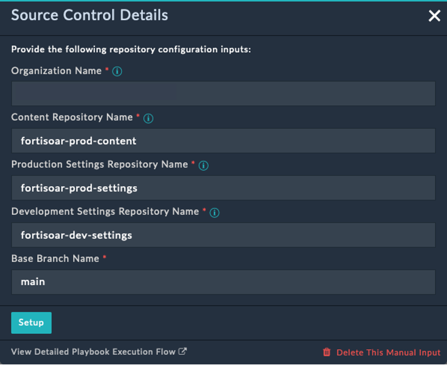

# Usage

In this section we detail the various user flows to get an understanding of the scenarios where this solution pack’s automation addresses our needs.

## Setup Source Control for Production Environment

You can setup GitHub as a source control management through playbooks, automatically, or by pre-creating repositories on GitHub and linking them to FortiSOAR Continuous Delivery solution pack.
To setup GitHub as a source control and creating repositories using playbooks:

1. Select **Continuous Delivery** from the FortiSOAR menu.
2. Click the button **Setup Source Control** under the **Setup** tab’s **Setup the Source Control for Production Environment** section.
3. Click the button **Setup Prod Environment** from the lower left part of the screen.
4. Enter the GitHub username with which to map the username you used to log in to FortiSOAR.
5. Enter the GitHub Source Control details:

    

    1. Enter the Organization’s name as specified in GitHub.
    2. Enter the repository names to be created under the specified organization. To accept the auto-populated suggested name, leave the fields as-is.
    3. Enter the Base Branch Name to be created under the specified repositories. To accept the auto-populated suggested name, leave the field as-is.
    4. Click Setup to proceed.
    5. Click the button Create Repositories to let the playbooks automatically create the repo (repository) and the specified branch in each repo.
        1. Click the button I have the repositories if you have already created the repositories, with the exact same names as specified in the earlier step, on GitHub.
        2. Click the button Confirm, after creating the repositories, for FortiSOAR to check if the specified repositories exist.
    6. Click the button Push to push the content from FortiSOAR to the specified branch of the repository mentioned in Production Content.
    Pushing overwrites the contents of the repository mentioned in Production Content. You can click the button Skip to push the contents later.

## Setup Development Environment

Once you have setup source control for production environment, initiate the setup for development environment to keep dev changes under the purview of source control.

1. Select **Continuous Delivery** from the FortiSOAR menu.
2. Click the button **Setup Source Control** under the **Setup** tab’s **Setup the Source Control for Development Environment** section.
3. Click the button **Setup Dev Environment** from the lower left part of the screen.
4. Enter the GitHub username with which to map the username you used to log in to FortiSOAR.

## New Change Request from Production Environment

You can raise a change request (CR) from within the FortiSOAR’s production environment and assign it to a content developer for further action. To create a new CR and assign it to a content developer:

1. Select **Continuous Delivery** from the FortiSOAR menu.
2. Select the tab **Production**.
3. Click **+ Create New Request**.
4. Enter a **Summary** and an appropriate **Description** for the CR.
5. Select a user from the **Assignee** drop-down to assign the CR.
6. Click **Submit** to save and submit the CR for further action

The raised CR appears under **Issues** on GitHub under your organization’s Production Content repository.

It also appears under the Continuous Delivery menu for both the Application Administrator and the Content Developer to whom the issue is assigned.

## Working on the new Change Request

After content developers are done making the customizations to address the CR raised in FortiSOAR:

1. Select the CR and click **Push Changes to Source Control**. Following tasks are performed:
    1. A branch containing the changes of this CR is created on GitHub.
    2. The changes are committed and pushed to the new branch.
2. Select the CR again and click **Submit Changes for Review**. Creation of a PR is initiated.
3. Specify a **Title** of the PR.
4. Specify **Reviewers Name** as comma-separated values.

## Approve & mark as complete a CR in Production environment

The CR submitted for review needs approval of the application administrator in FortiSOAR. The application administrator now has to approve, merge, and mark the changes as complete in production environment.

1.	Select **Continuous Delivery** from the FortiSOAR menu.
2.	Select the tab **Production**.
3.	CRs with changes appear with a PR name under the column Pull Request.

    >**NOTE**: The reviewers have to log in to GitHub to view the comparatable differences (`diff`).

4.	Select the CR in FortiSOAR and click **Approve Changes**. This merges the PR into the main branch and deletes the CR branch.
5.	Select the CR again and click **Mark as Complete** to close the issue from FortiSOAR and GitHub.

## Apply Latest changes in Production environment

Application administrators may want to merge the customizations on GitHub on the main branch to production instance on FortiSOAR.

1.	Select **Continuous Delivery** from the FortiSOAR menu.
2.	Select the tab **Production**.
3.	Click the tile Apply Latest Content to initiate a git merge of content on GitHub with content on the FortiSOAR instance.

## Save Development Settings

1.	Select **Continuous Delivery** from the FortiSOAR menu.
2.	Select the tab **Development**.
3.	Click the tile **Save Development Settings** to initiate export of development settings like connector configurations, SSO settings, and user configurations to GitHub in the repository mapped with FortiSOAR Development Settings.

## CR for a new Playbook Collection

This task entails following sub-tasks:

1.	Application administrator creates a new CR for creating the new playbook collection. For creating a new CR refer to the [New Change Request from Production Environment](#new-change-request-from-production-environment).
2.	Content Developer creates a new playbook collection and underlying playbooks. For creating new playbooks within a new playbook collection, refer [Introduction to playbooks](https://docs.fortinet.com/document/fortisoar/7.3.1/playbooks-guide/331279/introduction-to-playbooks).
3.	Content developer edits the export template and adds the newly created playbook collection in **Source Control – Production Content** export template. For details on editing an export template, refer to [Export Wizard](https://docs.fortinet.com/document/fortisoar/7.3.1/administration-guide/97786/application-editor#Export_Wizard).
4.	Content developer starts [Working on the new Change Request](#working-on-the-new-change-request).
5.	Application administrator [Approves & marks as complete the CR in Production environment](#approve--mark-as-complete-a-cr-in-production-environment).
6.	Application administrator also merges latest changes from GitHub by [Applying Latest changes in Production environment](#apply-latest-changes-in-production-environment).

This flow is valid for all content customizations like:
- Modules
- Reports
- Dashboards
- Playbooks
- Rules and channels, and
- Any other administrative and security settings.
